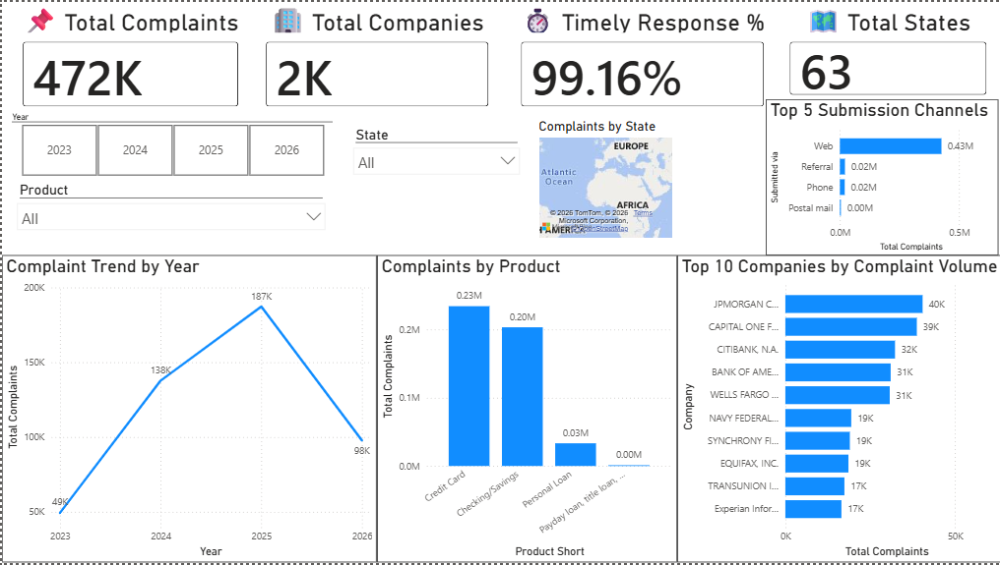
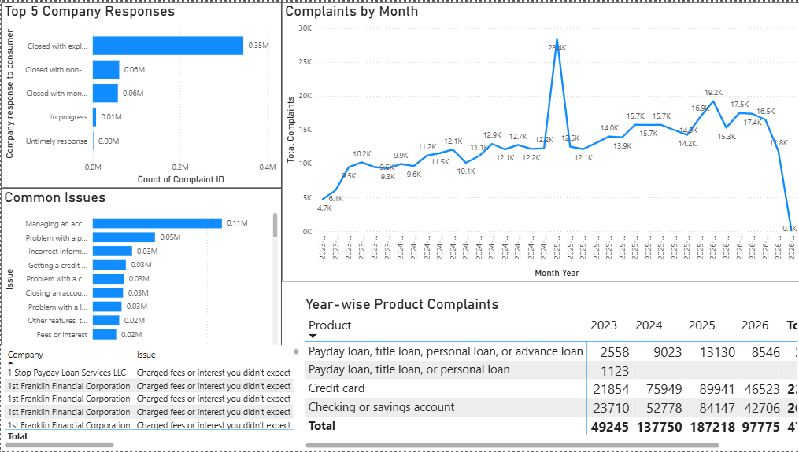

# 🏦 Banking Complaint Analytics & Policy Intelligence Platform

A complete end-to-end Data Analytics project built using **Python, SQL, SQLite, and Power BI** to analyze nearly **472,000 consumer banking complaints** submitted to financial institutions.

The project demonstrates a real-world analytics workflow—from raw data ingestion and cleaning to SQL-based business analysis and executive dashboard development.

---

## 📌 Project Overview

Financial institutions receive thousands of consumer complaints every month regarding credit cards, loans, bank accounts, payment services, and more.

The objective of this project is to:

- Analyze complaint trends over time
- Identify high-risk financial products
- Discover companies receiving the highest complaint volumes
- Measure response efficiency
- Generate actionable business insights
- Build an interactive executive dashboard for decision-makers

---

## 🛠 Tech Stack

- Python
- Pandas
- NumPy
- SQLite
- SQL
- Power BI
- Git
- GitHub

---

## 📂 Project Structure

```text
Banking_Complaint_Analytics
│
├── assets
│
├── data
│   ├── raw
│   └── cleaned
│
├── python
│   ├── etl
│   └── analysis
│
├── sql
│
└── README.md
```

---

## 📸 Dashboard Preview

### Executive Dashboard



---

### Business Insights Dashboard



---

# ⚙️ ETL Workflow

The project follows a complete ETL (Extract, Transform, Load) pipeline before performing business analysis.

### Extract

- Loaded raw complaint dataset
- Performed initial inspection
- Verified schema and data quality

### Transform

- Removed duplicate records
- Handled missing values
- Standardized date formats
- Cleaned categorical fields
- Created analysis-ready dataset

### Load

- Loaded cleaned dataset into SQLite database
- Queried using SQL for business analysis
- Connected SQLite with Power BI for dashboard creation

---

# 🗄 SQL Business Analysis

Several SQL queries were written to answer real-world business questions such as:

- Top companies by complaint volume
- Top complaint categories
- Complaint distribution across states
- Timely response percentage
- Monthly complaint trend
- Company-wise complaint ranking
- Product-wise complaint analysis
- Window functions (ROW_NUMBER, RANK, DENSE_RANK)
- CTE-based business reports
- Aggregate and analytical functions

---

# 📊 Executive Dashboard Highlights

The dashboard provides an executive-level overview including:

- Total Complaints
- Total Companies
- Timely Response Rate
- Total States
- Complaint Trend by Month
- Product-wise Complaint Distribution
- Top Companies by Complaint Volume
- Complaint Distribution Across States
- Top Submission Channels

Interactive slicers allow filtering by:

- Year
- Product
- State

---

# 💡 Key Business Insights

Some major insights obtained from the analysis include:

- Credit Cards generated the highest complaint volume across all products.
- Checking and Savings Accounts were the second largest contributor.
- Complaint volume peaked during 2025 before declining in 2026.
- Over 99% of complaints received a timely response from financial institutions.
- JPMorgan Chase, Capital One, Citibank, Bank of America, and Wells Fargo consistently ranked among the companies receiving the highest number of complaints.
- Web was the dominant complaint submission channel.
- Complaint patterns varied significantly across different financial products and states.

---

# 🎯 Skills Demonstrated

This project demonstrates practical experience with:

- Data Cleaning
- Exploratory Data Analysis
- SQL Query Optimization
- Common Table Expressions (CTEs)
- Window Functions
- Business KPI Development
- Interactive Dashboard Design
- Power BI Data Modeling
- Data Visualization
- Business Storytelling
- Git Version Control

---

# 🚀 Future Improvements

Possible enhancements include:

- Predictive complaint forecasting using Machine Learning
- Automated ETL pipeline
- Live database integration
- REST API for dashboard updates
- Customer sentiment analysis using NLP
- Real-time complaint monitoring dashboard

---

# 👩‍💻 Author

**Aakanksha Badgujar**

B.Tech Computer Science Engineer

Aspiring Data Analyst | SQL | Python | Power BI | Data Visualization